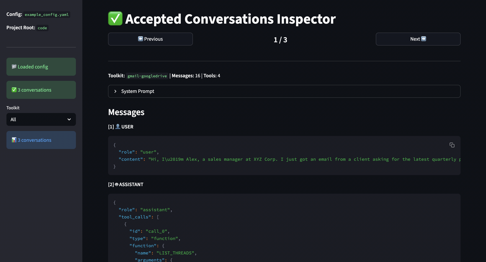

# Funcdex-Synthesizer
This repository hosts code used to generate the [Funcdex-MT-Function-Calling](https://huggingface.co/datasets/prem-research/Funcdex-MT-Function-Calling) dataset and subsequently, for training the [Funcdex](https://huggingface.co/collections/prem-research/funcdex) models.

This codebase can be used to generate ReAct-like Multi-turn Function Calling Datasets. *Thinking generation can be turned off!*

You only need to provide:
1. Tool definitions
2. Natural Language Workflow Description (optional, can be infered from the tool definitions).

This codebase comes with about *14000 tool definitions* covering more than *600 popular applications!*. See [src/data/tool_definitions.json](src/data/tool_definitions.json). 

If your application is not present, you can simply add them. Either use the utility script we provide to ingest OpenAPI Spec JSON, or add them manually.

[Funcdex-MT-Function-Calling](https://huggingface.co/datasets/prem-research/Funcdex-MT-Function-Calling) contains tool-definition grounded conversations with the following toolkits:

| Toolkit/Bundle Name                         | Checkpoint Link                                                                    |
|---------------------------------------------|-------------------------------------------------------------------------------------------|
| `ALL TOOLKITS`                              | [Funcdex-1.7B](https://huggingface.co/prem-research/Funcdex-1.7B)                         |
| `gmail`                                     | [Funcdex-0.6B-gmail](https://huggingface.co/prem-research/Funcdex-0.6B-gmail)             |
| `googlecalendar`                            | [Funcdex-0.6B-googlecalendar](https://huggingface.co/prem-research/Funcdex-0.6B-googlecalendar) |
| `googledrive`                               | [Funcdex-0.6B-googledrive](https://huggingface.co/prem-research/Funcdex-0.6B-googledrive)   |
| `googledocs`                                | [Funcdex-0.6B-googledocs](https://huggingface.co/prem-research/Funcdex-0.6B-googledocs)     |
| `jira`                                      | [Funcdex-0.6B-jira](https://huggingface.co/prem-research/Funcdex-0.6B-jira)                 |
| `stripe`                                    | [Funcdex-0.6B-stripe](https://huggingface.co/prem-research/Funcdex-0.6B-stripe)             |
| `asana`                                     | [Funcdex-0.6B-asana](https://huggingface.co/prem-research/Funcdex-0.6B-asana)               |
| `calendly`                                  | [Funcdex-0.6B-calendly](https://huggingface.co/prem-research/Funcdex-0.6B-calendly)         |
| `whatsapp`                                  | [Funcdex-0.6B-whatsapp](https://huggingface.co/prem-research/Funcdex-0.6B-whatsapp)         |
| `todoist`                                   | [Funcdex-0.6B-todoist](https://huggingface.co/prem-research/Funcdex-0.6B-todoist)           |
| `gmail_googlecalendar`                      | [Funcdex-0.6B-gmail_googlecalendar](https://huggingface.co/prem-research/Funcdex-0.6B-gmail_googlecalendar) |
| `googledrive_googledocs`                    | [Funcdex-0.6B-googledrive_googledocs](https://huggingface.co/prem-research/Funcdex-0.6B-googledrive_googledocs) |
| `jira_gmail`                                | [Funcdex-0.6B-jira_gmail](https://huggingface.co/prem-research/Funcdex-0.6B-jira_gmail)     |
| `googledrive_calendly_googlecalendar`       | [Funcdex-0.6B-googledrive_calendly_googlecalendar](https://huggingface.co/prem-research/Funcdex-0.6B-googledrive_calendly_googlecalendar) |
| `whatsapp_todoist`                          | [Funcdex-0.6B-whatsapp_todoist](https://huggingface.co/prem-research/Funcdex-0.6B-whatsapp_todoist) |

Our general model, [Funcdex-1.7B](https://huggingface.co/prem-research/Funcdex-1.7B) is 20% more performant and 2x less expensive than gpt-oss-120b.

|LLM                    |Function Call Match   |Cost ($)          |
|-----------------------|----------------------|------------------|
|GPT-OSS-120B (medium)  |0.51                  |9.32              |
|GPT-5 Mini (medium)    |0.58                  |99.71             |
|GPT-5 (minimal)        |0.59                  |205.45            |
|Qwen3-0.6B             |0.59                  |2.83              |
|Qwen3-1.7B             |0.69                  |5.73              |
|**Funcdex-0.6B**         |**0.70**                |**0.19**            |
|**Funcdex-1.7B**         |**0.81**                |**5.64**            |

Notes:
- *Funcdex-0.6B is the average of performances of individual Funcdex-0.6B models.*
- For cost, we track the number of prompt/completion tokens for evaluating 300 conversations.
- e.g. If token cost is input=$1 and output=$10 per million tokens, and evaluation needed `0.5M` and `0.1M` input/output tokens, then cost is `1 * 0.5 + 0.1 * 10 = $1.5`.
- *Qwen3-0.6B and Qwen3-1.7B evaluation costs are estimated by extrapolating from Llama3.2-3B serverless costs. Other model's costs are sourced from Openrouter.*

For more details, refer to the blog post.

Fun Fact: The name Funcdex is inspired from Pokedex -> Catch all the Functions!
# Quickstart

This section sets up a simple dataset of 3 conversations involving the use of two applications/toolkits - Gmail and Google Drive.

## Environment
1. [Install uv](https://docs.astral.sh/uv/getting-started/installation/) then run the following:

```
git clone https://github.com/premAI-io/Funcdex-Synthesizer
cd Funcdex-Synthesizer
uv sync
source .venv/bin/activate
```

## Generator LLM

You have two options: 
1. Local with `openai/gpt-oss-120b` (either vLLM or llama.cpp). **Recommended**
2. Any LLM with a cloud provider that supports GBNF such as [Fireworks.ai](https://docs.fireworks.ai/structured-responses/structured-output-grammar-based#why-grammar-based-structured-output%3F). **Untested!**

In either scenario, update your LLM configuration in the config file: [examples/example_config.yaml](examples/example_config.yaml).

## Local vLLM Deployment

1. Follow the steps [here to install vLLM](https://docs.vllm.ai/en/stable/getting_started/installation/index.html).
2. Serve [openai/gpt-oss-120b](openai/gpt-oss-120b) using `CUDA_VISIBLE_DEVICES=0 vllm serve openai/gpt-oss-120b`.

Note: The pipeline is CPU-bottlenecked due to Context-free Grammar compilation. Using multiple GPUs will not speed up the process too much.

## Generation
Run `python scripts/run_pipeline.py examples/example_config.yaml` and grab a cup of coffee while it runs.

It should take roughly 5 mins for this to finish.

- To generate the full dataset similar to Funcdex-MT-Function-Calling, run `python scripts/run_pipeline.py config.yaml` 


You should see files populated in `outputs/`.

The file you are interested in is `outputs/parsed_conversations.jsonl`. 

This can be used directly in TRL or Unsloth to finetune models!

For more information, refer to [this page](https://huggingface.co/docs/trl/main/en/dataset_formats#tool-calling).

## Inspect Conversations

You may want to verify if the conversations match your usecase.

Enjoy the ~~Slop~~ Vibe-coded streamlit app to visualize the conversations by running:
```
streamlit run examples/utils/streamlit_inspector.py examples/example_config.yaml
```
And open `http://localhost:8501` in your browser.

You should see a screen like so:


# Not-so-Quickstart


## Definitions

*Tool/API*:
- External functions that must execute with given parameters and return the result to the LLM for further processing.

*Toolkit*: 
- A set of tools that are related some way (coming from the same service/application). E.g. `UPDATE_CALENDAR_LIST_ENTRY` and `CREATE_EVENT` below are API routes supported by Google Calendar.

*Bundle*:
- A set of toolkits -> E.g. your workflow involves using both Calendly and Gmail tools.

## Problem Statement
Let's say this is you:
```
I get similar set of questions that are usually present in either in my gmail or google drive.
Can I ask an LLM to search through my Gmail or google drive to answer questions?
```

You infer that Gmail and Google Drive have [these APIs](examples/data/gmail_drive_tools.json) that can help solve this problem:
```
[
    {
        "toolkit_name": "gmail",
        "tool_id": "FETCH_EMAILS",
        "tool_description": "Fetches a list of email messages from a gmail account, supporting filtering, pagination, and optional full content retrieval.",
        "tool_input_parameters": "{\"ids_only\": {\"type\": \"boolean\", \"required\": false}, \"include_payload\": {\"type\": \"boolean\", \"required\": false}, \"include_spam_trash\": {\"type\": \"boolean\", \"required\": false}, \"label_ids\": {\"type\": \"array\", \"required\": false}, \"max_results\": {\"type\": \"integer\", \"required\": false}, \"page_token\": {\"type\": \"string\", \"required\": false}, \"query\": {\"type\": \"string\", \"required\": false}, \"user_id\": {\"type\": \"string\", \"required\": false}, \"verbose\": {\"type\": \"boolean\", \"required\": false}}",
        "tool_response_parameters": "{\"data\": {\"type\": \"object\", \"required\": true}, \"error\": {\"type\": \"string\", \"required\": false}, \"successful\": {\"type\": \"boolean\", \"required\": true}}"
    },
    {
        "toolkit_name": "gmail",
        "tool_id": "LIST_THREADS",
        "tool_description": "Retrieves a list of email threads from a gmail account, identified by `user id` (email address or 'me'), supporting filtering and pagination.",
        "tool_input_parameters": "{\"max_results\": {\"type\": \"integer\", \"required\": false}, \"page_token\": {\"type\": \"string\", \"required\": false}, \"query\": {\"type\": \"string\", \"required\": false}, \"user_id\": {\"type\": \"string\", \"required\": false}, \"verbose\": {\"type\": \"boolean\", \"required\": false}}",
        "tool_response_parameters": "{\"data\": {\"type\": \"object\", \"required\": true}, \"error\": {\"type\": \"string\", \"required\": false}, \"successful\": {\"type\": \"boolean\", \"required\": true}}"
    },
    {
        "toolkit_name": "googledrive",
        "tool_id": "FIND_FILE",
        "tool_description": "Tool to list or search for files and folders in google drive. use when you need to find specific files based on query criteria or list contents of a drive/folder.",
        "tool_input_parameters": "{\"corpora\": {\"type\": \"string\", \"required\": false}, \"driveId\": {\"type\": \"string\", \"required\": false}, \"fields\": {\"type\": \"string\", \"required\": false}, \"includeItemsFromAllDrives\": {\"type\": \"boolean\", \"required\": false}, \"orderBy\": {\"type\": \"string\", \"required\": false}, \"pageSize\": {\"type\": \"integer\", \"required\": false}, \"pageToken\": {\"type\": \"string\", \"required\": false}, \"q\": {\"type\": \"string\", \"required\": false}, \"spaces\": {\"type\": \"string\", \"required\": false}, \"supportsAllDrives\": {\"type\": \"boolean\", \"required\": false}}",
        "tool_response_parameters": "{\"data\": {\"type\": \"object\", \"required\": true}, \"error\": {\"type\": \"string\", \"required\": false}, \"successful\": {\"type\": \"boolean\", \"required\": true}}"
    },
    {
        "toolkit_name": "googledrive",
        "tool_id": "LIST_FILES_AND_FOLDERS",
        "tool_description": "Tool to list a user's files and folders in google drive. use this to search or browse for files and folders based on various criteria.",
        "tool_input_parameters": "{\"corpora\": {\"type\": \"string\", \"required\": false}, \"driveId\": {\"type\": \"string\", \"required\": false}, \"fields\": {\"type\": \"string\", \"required\": false}, \"folderId\": {\"type\": \"string\", \"required\": false}, \"includeItemsFromAllDrives\": {\"type\": \"boolean\", \"required\": false}, \"includeLabels\": {\"type\": \"string\", \"required\": false}, \"includePermissionsForView\": {\"type\": \"string\", \"required\": false}, \"orderBy\": {\"type\": \"string\", \"required\": false}, \"pageSize\": {\"type\": \"integer\", \"required\": false}, \"pageToken\": {\"type\": \"string\", \"required\": false}, \"q\": {\"type\": \"string\", \"required\": false}, \"spaces\": {\"type\": \"string\", \"required\": false}, \"supportsAllDrives\": {\"type\": \"boolean\", \"required\": false}}",
        "tool_response_parameters": "{\"data\": {\"type\": \"object\", \"required\": true}, \"error\": {\"type\": \"string\", \"required\": false}, \"successful\": {\"type\": \"boolean\", \"required\": true}}"
    }
]
```

Now, this project will take these APIs as input, and synthesize a dataset that you can use to:
1. Evaluate performance of various LLMs.
2. Finetune Open LLMs.

**Note**: We provide a [convenience script](examples/utils/parse_openapi_spec.py) to convert OpenAPI Spec to the above format. More below.

## Tool Interactions

Answer these questions:
1. Do your workflows involve tools from different toolkits? 
- Yes -> Use bundles.
- No -> Use toolkits.

2. Now edit [this file](src/data/wanted_toolkits.json) based on your answers.

## Configuration

Listing only the most useful ones:
1. `include_assistant_thoughts`: Generate a dataset for training a thinking/non-thinking assistant.
2. `total_conversations`: How many conversations to generate.
3. Contents of `src/data/wanted_toolkits.json` and `src/data/tool_definitions.json`
4. All of these:
```yaml

  data:
    tool_definitions: src/data/wanted_toolkits.json
    wanted_toolkits: src/data/tool_definitions.json

  output:
    conversations: outputs/conversations.jsonl
    conversations_with_system_prompts: outputs/conversations_with_system_prompts.jsonl
    scored_conversations: outputs/scored_conversations.jsonl
    accepted_conversations: outputs/accepted_conversations.jsonl
    parsed_conversations: outputs/parsed_conversations.jsonl
# In config.yaml
llm_api:
  api_key: ${OPENAI_API_KEY:empty}  # Uses env var or defaults to "empty"
  base_url: ${LLM_BASE_URL:http://localhost:8000/v1/}
  model: ${LLM_MODEL:openai/openai/gpt-oss-120b}
```

## Method

The pipeline uses a Multi-agent process to synthesize conversations. The generation is done in a way to reduce duplication, encourage diversity and provide high-quality tool use signal for finetuning.

### Generate User Request/Scenario
- Sample random combination of tools from the given set.
- If a natural language `workflow_description` is provided, use that to generate similar workflows else prompt an LLM to synethesize a user workflow that involves the use of sampled tools.
- Deduplicate user scenario -> Use an embedding model to discard the scenario if a very similar scenario already exists.

### Generate a User Persona
- Prompt an LLM to generate a user's background (company name, position, and other relating context). This is used to make the conversation context richer and less "slop".

### Generate a Conversation Outline (Disposition)
- Prompt an LLM to generate how the conversation would look like if the workflow was carried out by chatting with an LLM assistant.

### Generate the Conversation
- Prompt an LLM with all of the generated artefacts, including tool definitions to generate a conversation in the following format:
```
</user> Hey, can you help me plan a spontaneous weekend getaway for two?
</assistant> I'd love to! To get started, what dates are you thinking of for this weekend, and where will you be traveling from?
<tool>
{
  "name": "get_current_location",
  "arguments": {}
}
</tool>
<tool_response>
{
  "city": "Paris",
  "country": "France"
}
</tool_response>
</assistant> And are there any particular vibes you're going for? For example, are you looking for a romantic trip, a culinary adventure, a historical deep-dive, or something else?
</user> Let's do next weekend, so that would be Friday, October 3rd to Sunday, October 5th. We'll be leaving from my current location. We're both big foodies and love history.
```
We call this the **Dialog Markup Language (DML)**.

In practice, just prompting doesn't work well. Even the strongest closed-LLMs (GPT-5-High, Gemini 2.5 Pro, Deepseek v3.2) will generate conversations that don't obey basic conversation flow. Some examples:
- Each `<tool_call>` must have its corresponding `<tool_response>`.
- Each `</user>` message should be followed by either a `</assistant>` message or a `<tool_call>`.
- `<tool_response>` must always be followed by either `</assistant>` or `<tool_call>`.
- etc..

A simple post-generation validation step to reject bad conversations doesn't work -- **more than 90% of generations are rejected!**
To solve this, we use Context-free Grammar-based constrained decoding to force the LLM to generate valid conversations in DML format.
The grammar rules are defined in [here (without assistant thinking)](src/grammars/dml_grammar_without_thoughts.gbnf) and [here](src/grammars/dml_grammar_with_thoughts.gbnf). Read more: [vLLM Structured Outputs](https://docs.vllm.ai/en/stable/features/structured_outputs.html#example-materials) and [llama.cpp](https://github.com/ggml-org/llama.cpp/blob/master/grammars/README.md).

Though this comes with its own problems; Constrained decoding is CPU-bound, as the logit mask generation happens on the CPU, as a result, GPU will be idle majority of the time -> Making the generation extremely slow.

#### Converting from OpenAPI Specification

If you have an OpenAPI 3.x specification, you can automatically convert it to the tool definition format:

```bash
python3 examples/utils/parse_openapi_spec.py \
    --input path/to/openapi.json \
    --output path/to/output.json \
    --toolkit-name your_toolkit_name
```

**Note**: The converter has limitations (nested objects are simplified, response schemas are merged). Review the output before using in production. 

### Generate System Prompts
- Prompt the LLM with all artefacts to generate a short system prompt for each conversation.
- We recommend a "drop-out"-like setup for training so that the finetuned model doesn't rely too much on the system prompt, but also is steerable.

### Score and Reject Bad Conversations
- We use an LLM-as-Judge approach to score and filter conversations.
- We use a comprehensive rubric and only keep conversations that score 4 or above in `tool_use_quality` metric.

## Known issues
- If the tool expects file content, the pipeline will produce tool calls containing arguments like `"content": "<base64-encoded-content>"`.
- Deduplication using Vector embeddings is not good enough. We've noticed that both: false positives and negatives, even with Qwen3-Reranker-8B.
- Pipeline performance is poor. It takes about 15 hours to generate 1700 conversations on 4 H200 GPUs.
- Conversation realism: Although the conversations are better than any public offering, the conversations still don't feel very natural. Idea: Use a better User simulator such as [UserLM-8b](https://huggingface.co/microsoft/UserLM-8b).
- We didn't try optimizing the prompts at all. 
- This codebase was refactored for release and has not been tested thoroughly in its current form. If you find a bug, please open an issue, we will attend to it at the earliest.
- No support for Parallel function calling, only multi-step.
- There is no rejection of examples apart from the embedding -- perhaps using n-gram overlap or ROUGE scores to dedup conversations are possible extensions.
- Generated conversations are "happy paths" -> it doesn't teach the model to recover from errors.


## Acknowledgements
We build on [Composio.dev](Composio.dev)'s list of tool definitions to power this project.

## License
The codebase, dataset, models are licensed under MIT License.
